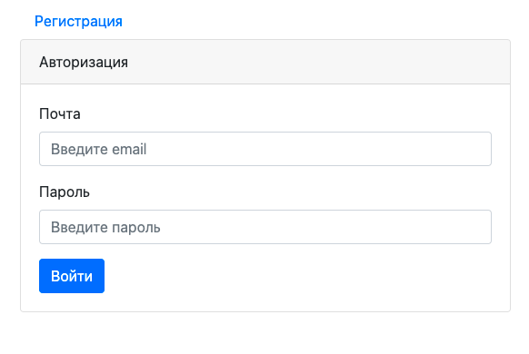
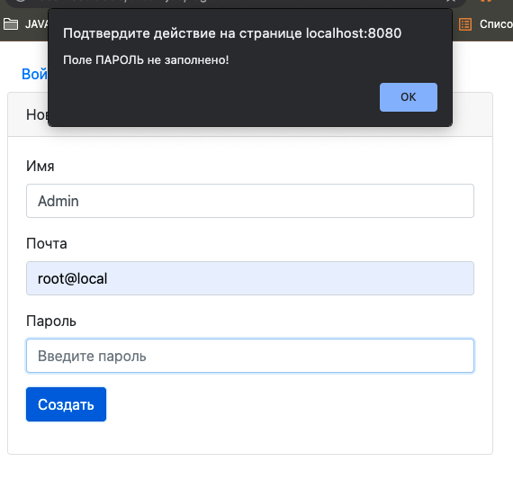
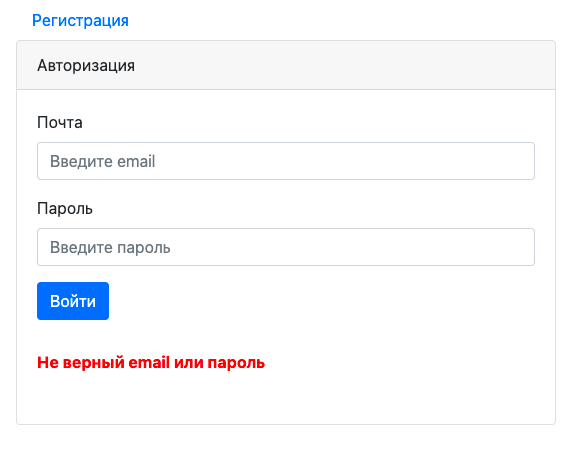
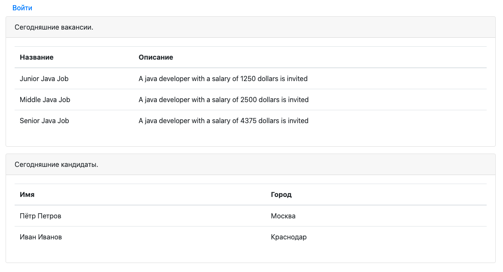
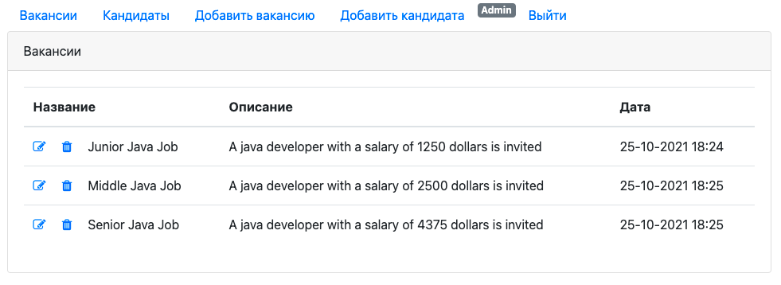
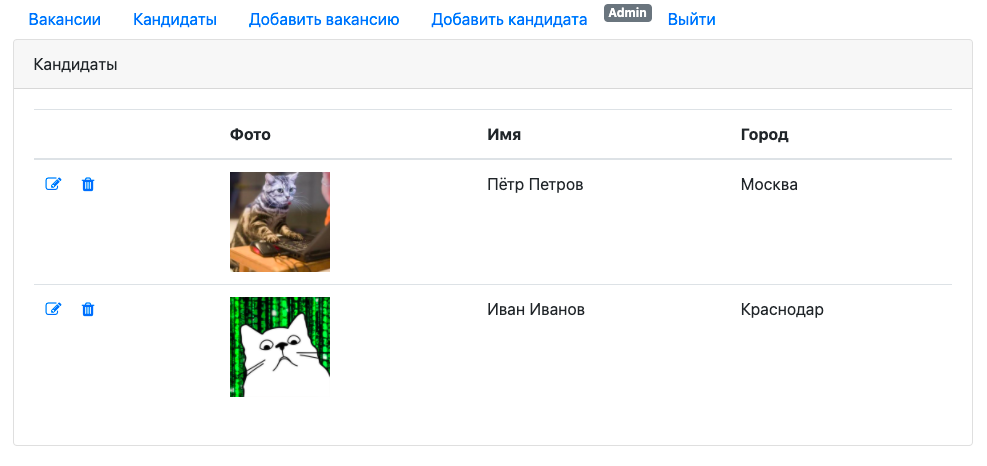
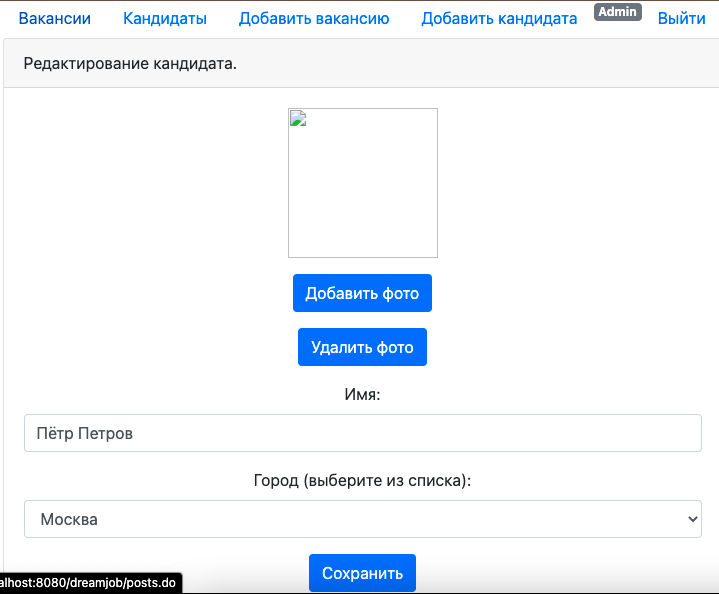
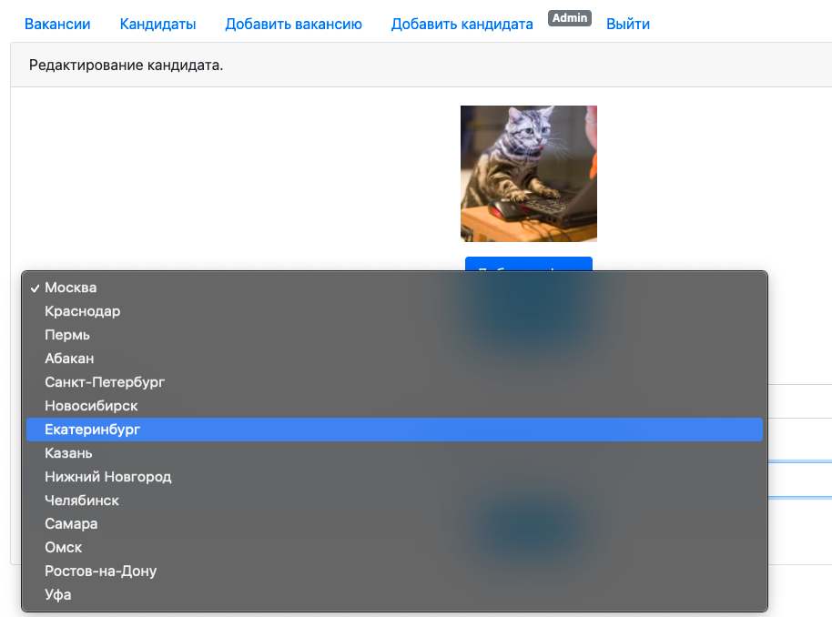

# Dream Job

## О проекте. 
Dream Job - приложение "биржа работы".
В системе два типа пользователей: кандидаты и кадровики.
- Кандидаты: 
  - публикуют резюме. 
  - могут откликнуться на вакансию.
- Кадровики: 
  - публикуют вакансии о работе. 
  - могут пригласить на вакансию кандидата.

Использованы технологии:

- Java EE Servlet API
- Apache Tomcat
- JDBC
- PostgreSQL
- JS (jQuery, AJAX), JSP, JSTL, HTML
- Log4j
- Maven
- Travis CI

## Сборка и установка. 
Сборка проекта осуществляется в WAR-архив с помощью Maven:

`mvn install`

с последующим развертыванием в контейнере сервлетов 
(Apache Tomcat и т.п.) 

## Контакты.
Если у вас есть какие-либо вопросы, не стесняйтесь обращаться ко мне:

Евгений Зайцев

[cyberfuzzapps@gmail.com](mailto:cyberfuzzapps@gmail.com)
