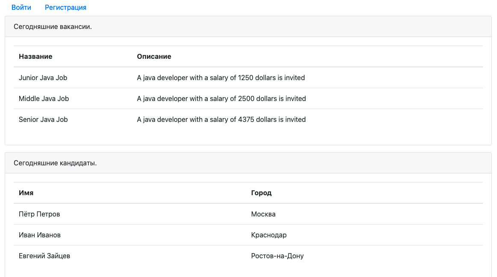
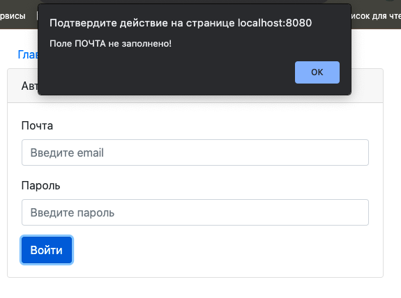
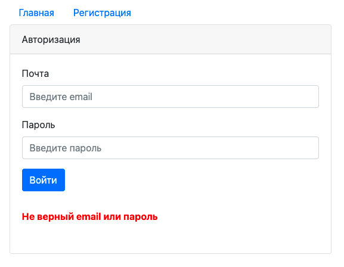
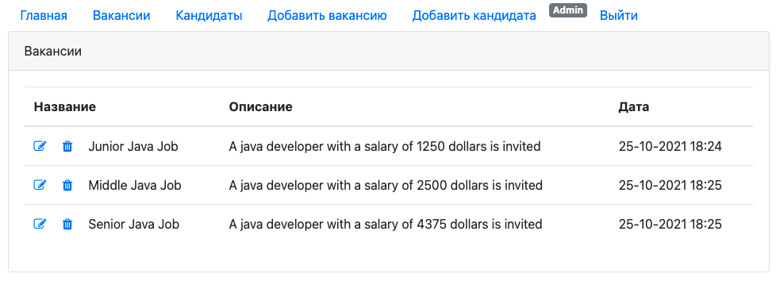
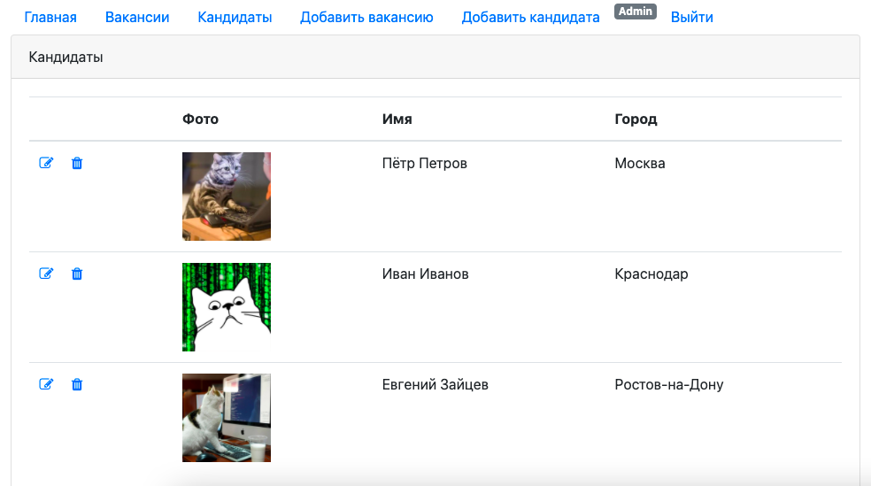
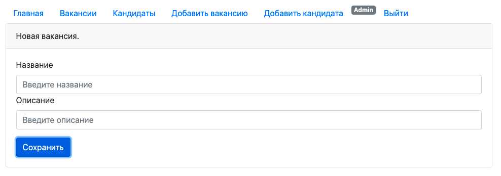
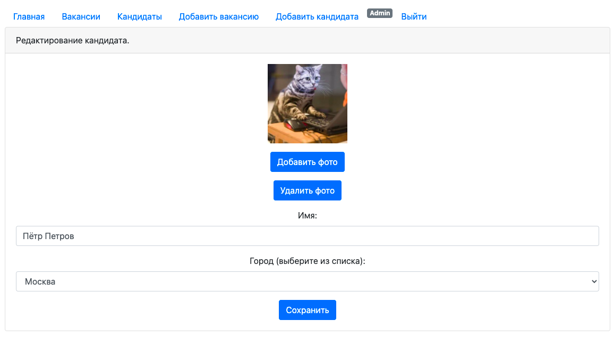
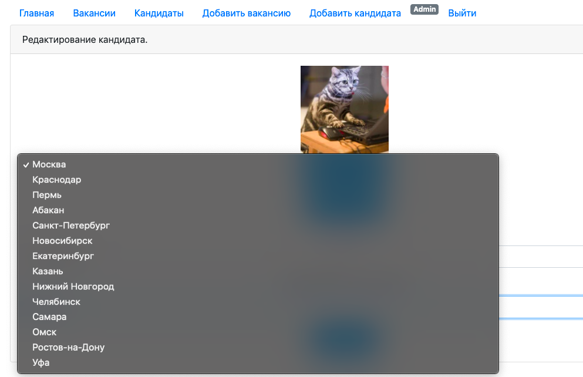

# Dream Job

## О проекте. 
Dream Job - приложение "биржа работы".
В системе два типа пользователей: кандидаты и кадровики.
- Кандидаты: 
  - публикуют резюме. 
  - могут откликнуться на вакансию.
- Кадровики: 
  - публикуют вакансии о работе. 
  - могут пригласить на вакансию кандидата.

Использованы технологии:

- Java EE Servlet API
- Apache Tomcat
- JDBC
- PostgreSQL
- JS (jQuery, AJAX), JSP, JSTL, HTML
- Log4j
- Maven
- Travis CI

Тестирование:

- Liquibase
- H2DB
- JUnit
- Hamcrest

## Сборка и установка. 

В Maven создано два профиля:

- `test` - тестирование c Liquibase в базе данных H2DB.

`mvn test -Ptest`

- `production` - сборка в WAR-архив для развертывания 
в контейнере сервлетов (Apache Tomcat и т.п.)

`mvn install -Pproduction -Dmaven.test.skip=true`

Скрипты для базы данных: db/schema.sql

## Контакты.
Если у вас есть какие-либо вопросы, не стесняйтесь обращаться ко мне:

Евгений Зайцев

[cyberfuzzapps@gmail.com](mailto:cyberfuzzapps@gmail.com)
